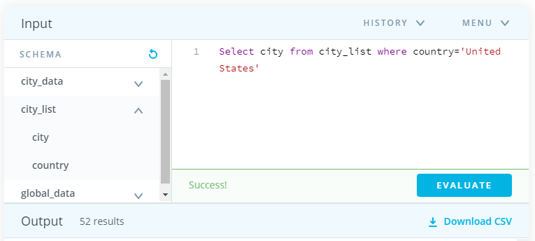
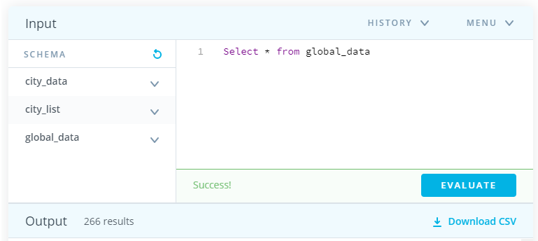
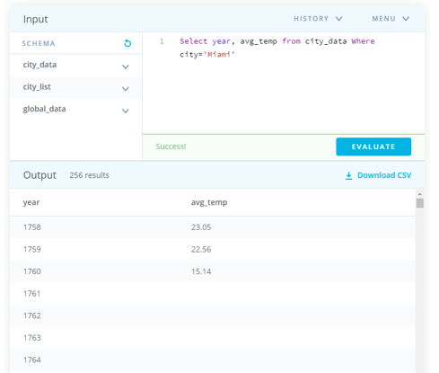
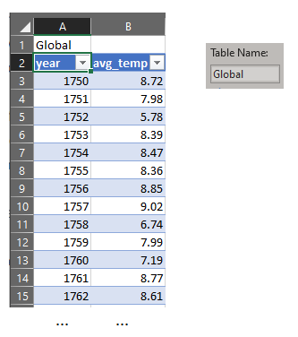
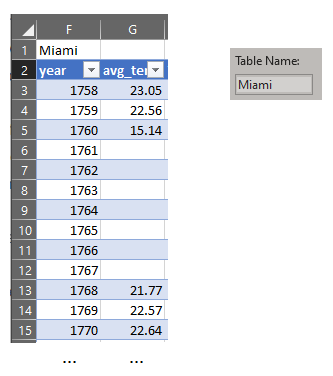
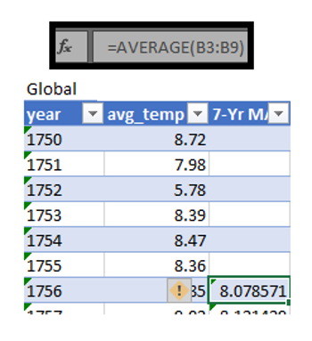
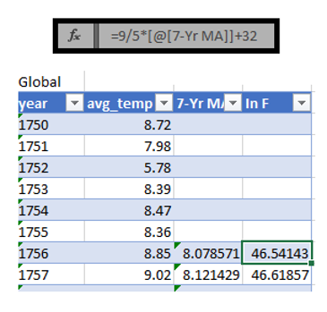
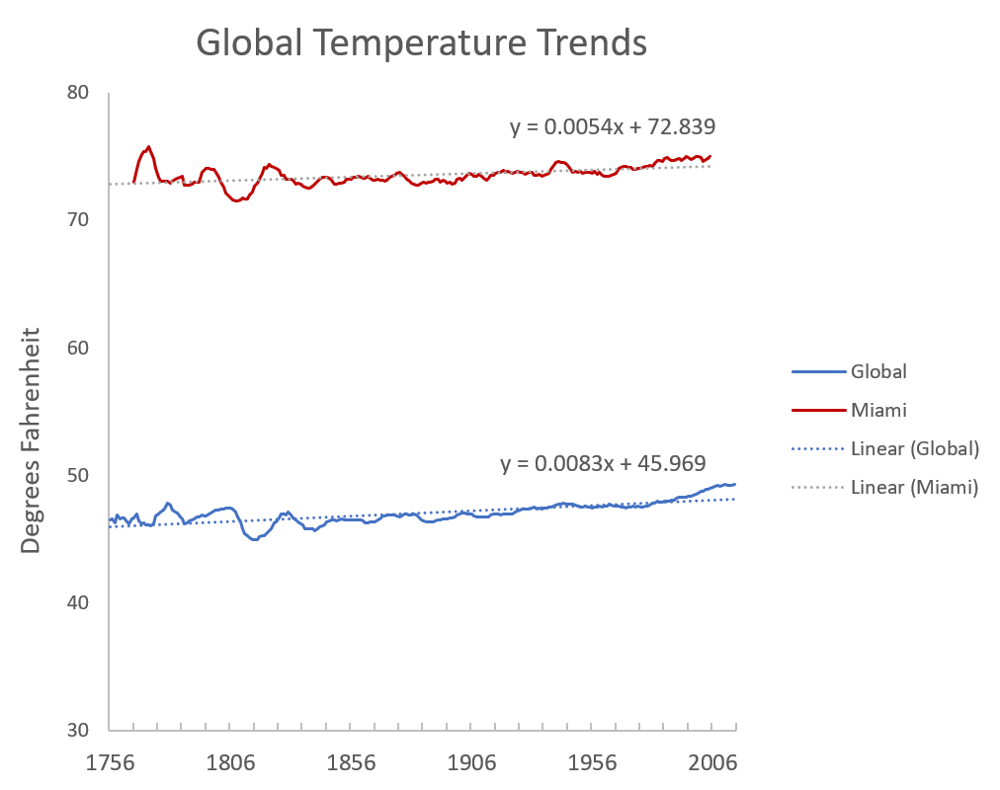
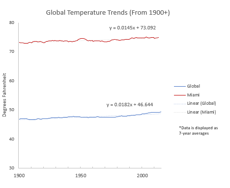
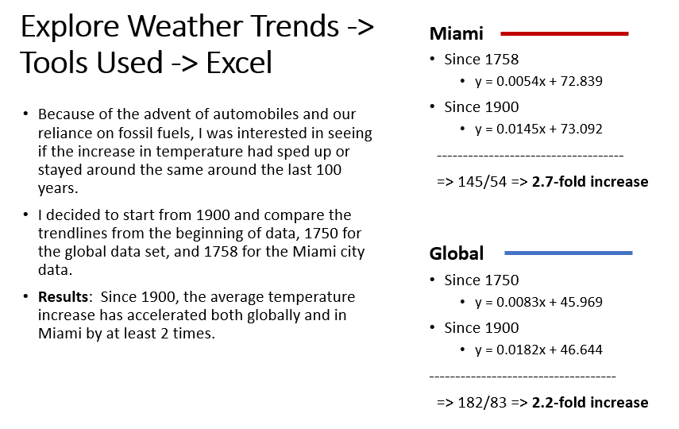

# Explore Weather Trends
by Kurt Pessa

### Section 1: SQL Queries
1. SQL query to discover the closest city
 
2. SQL query for global data
 
3. SQL query to select Miami's data set
 

### Section 2: Excel - Data Manipulation
1. Created table of global data set
 
2. Created table of Miami's data set
 

#### Moving averages
- Added column of 7-year moving average for global and Miami data set
 
#### Converting from Celcius to Fahrenheit
- Was interested in seeing the data in Fahrenheit instead of Celcius, so converted temperatures to Fahrenheit. 
 

### Section 3: Excel - Data Visualization
#### Global temperature trends
- Plotted data using line chart with 7-year averages. 
 

#### Global temperature trend from 1900 on
- Replotted data from 1900
 

#### Comparing trends from 1750 vs from 1900
 

