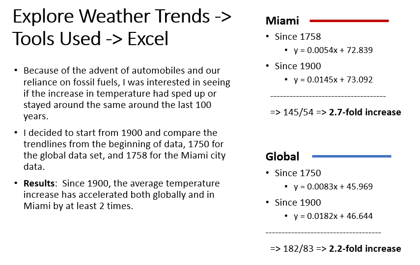

# Explore Weather Trends
by Kurt Pessa

### Section 1: SQL Queries
1. SQL query to discover the closest city
 
2. SQL query for global data
 
3. SQL query to select Miami's data set
 

### Section 2: Excel - Data Manipulation
1. Created table of global data set
 
2. Created table of Miami's data set
 

#### Moving averages
- Added column of 7-year moving average for global and Miami data set
 
#### Converting from Celcius to Fahrenheit
- Was interested in seeing the data in Fahrenheit instead of Celcius, so converted temperatures to Fahrenheit. 
 

### Section 3: Excel - Data Visualization
#### Global temperature trends
- Plotted data using line chart with 7-year averages. 
 

#### Observation 1
- Is your city hotter or cooler on average compared to the global average? Has the difference been consistent over time?
	- **Yes**, the closest city, Miami, has definitely been hotter on average compared with the global average.  And, **yes**, the difference has been pretty consistent over time.

#### Observation 2

- "What does the overall trend look like? Is the world getting hotter or cooler?"
	- The overall trend looks like it's getting **hotter**, both globally and at the local area (in my case, Miami).

#### Global temperature trend over the past few hundred years (1900+)
- Replotted data from 1900
 

#### Comparing trends from 1750 vs from 1900
  

#### Observation 3

- "Has the trend been consistent over the last few hundred years?"
	- In terms of magnitude, the global linear trend is higher than Miami's linear trend, 0.0083 degrees Fahrenheit per year vs. 0.0054 degrees Fahrenheit per year for Miami.
	
	- When looking at the trend, the rate of increase of temperature has sped up.  Globally, the linear trend line went from 0.0083 to 0.0182, a **2.2-fold increase**. And for Miami, the linear trend went from 0.0054 to 0.0145, a **2.7-fold increase**.  

#### Observation 4
- “How do the changes in your city’s temperatures over time compare to the changes in the global average?”
	- Miami's 2.7-fold increase is greater than the global 2.2-fold increase.  It would be interesting to see if other cities temperatures increased at a greater rate over the past hundred years or so. 

